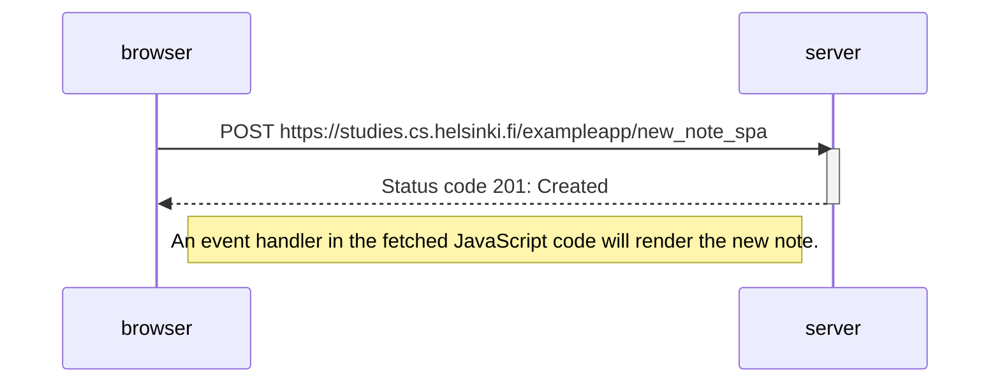

# Exercise 0.5
## New Note Diagram in SPA:

```mermaid
sequenceDiagram
participant browser
participant server

    browser->>server: POST https://studies.cs.helsinki.fi/exampleapp/new_note_spa
    activate server
    server-->>browser: Status code 201: Created          
    deactivate server

    Note right of browser: An event handler in the fetched JavaScript code will render the new note.
```